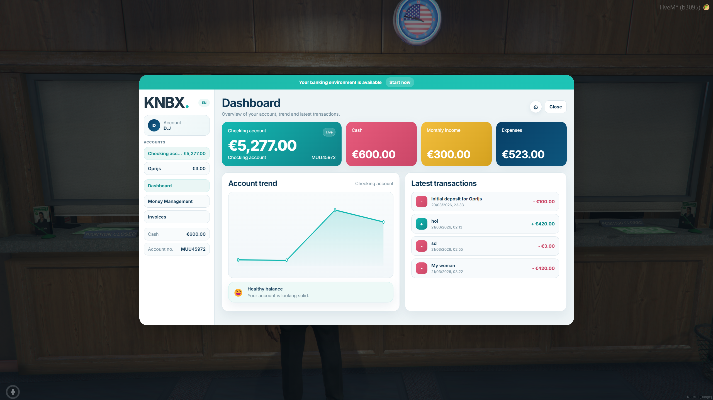
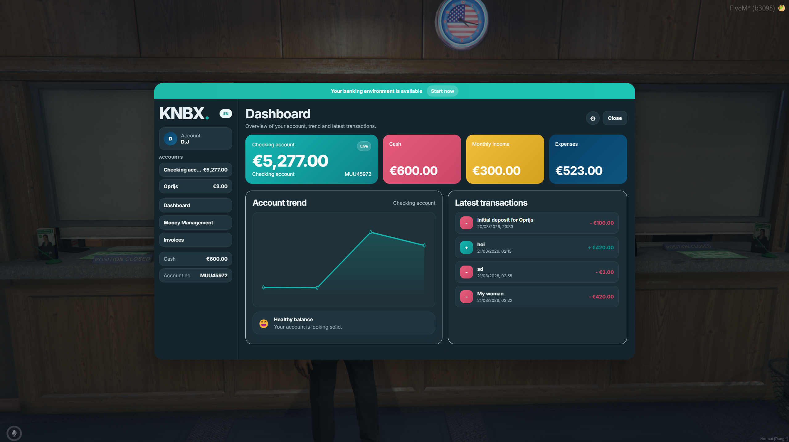
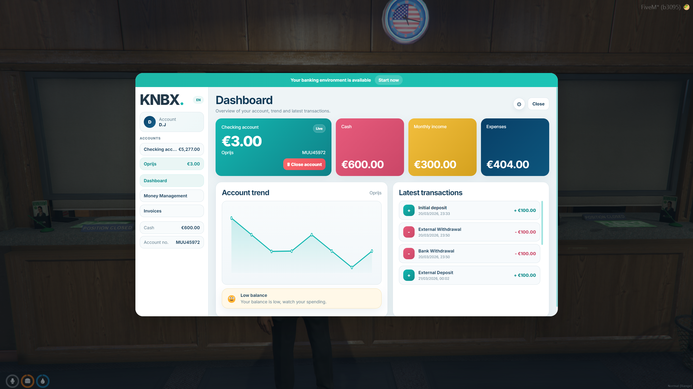

# qb-banking-alc-knbx

Free QBCore banking UI and UX overhaul based on `qbcore-framework/qb-banking`.

This release keeps the QBCore banking foundation and adds a cleaner KNBX styled interface, light and dark mode, language preference saving and small server side hardening for public use.

## Status

Community release. Free and open source under GPL-3.0.

Test this resource on a development server before production use. Banking resources affect player money and shared accounts, so do not deploy untested changes directly to a live economy.

## Preview

### Dashboard Light



### Dashboard Dark



### Account Overview



## Features

- Modern banking UI for FiveM NUI.
- QBCore banking compatibility.
- Checking, shared, job and gang account handling.
- Deposit, withdraw and transfer actions.
- Debit card PIN support.
- Invoice payment support where `phone_invoices` exists.
- EN and NL language support.
- Light and dark UI preference saving.
- Server side validation for account names and transaction amounts.
- Shared account access checks.
- Boss only access checks for job and gang accounts.
- Lightweight action cooldowns for banking spam protection.

## Requirements

- FiveM server.
- QBCore.
- `qb-core`.
- `qb-inventory`.
- `oxmysql`.
- `PolyZone`.
- `qb-target` optional, only if `UseTarget` is enabled.

## Installation

1. Download the release ZIP.
2. Extract the folder into your server resources directory.
3. Keep the folder name as:

```txt
qb-banking-alc-knbx
```

4. Import `banking.sql` into your database if your server does not already have the required banking tables.
5. Make sure dependencies start before this resource.
6. Add this to `server.cfg`:

```cfg
ensure qb-core
ensure qb-inventory
ensure oxmysql
ensure PolyZone
ensure qb-banking-alc-knbx
```

7. Restart the server.
8. Open the bank in game and run the manual test checklist below.

## Configuration

Edit `config.lua`.

```lua
Config.Debug = false
Config.MaxTransactionAmount = 100000000
Config.TransactionCooldown = 1000
Config.MaxAccountNameLength = 50
```

Important options:

- `Config.Debug`: Enables minimal debug logging when set to `true`.
- `Config.MaxTransactionAmount`: Maximum allowed amount for one transaction.
- `Config.TransactionCooldown`: Per player cooldown in milliseconds for money actions.
- `Config.maxAccounts`: Maximum number of shared accounts a player can create.
- `Config.useTarget`: Uses `qb-target` when enabled through the `UseTarget` convar.
- `Config.Branding`: Sets the banking brand label shown in the UI.
- `Config.UI`: Toggles specific interface sections.

## Upgrade Notes

- Back up your current banking resource and database first.
- Do not run this resource beside another `qb-banking` resource.
- Use one banking resource only.
- If replacing an existing banking resource, compare your current SQL schema before importing `banking.sql`.
- Test shared accounts, job accounts and gang accounts before release to players.

## Manual Test Checklist

- Start the server with dependency order confirmed.
- Open the banking UI at a bank location.
- Open the ATM UI with a bank card.
- Deposit a valid amount.
- Withdraw a valid amount.
- Transfer a valid amount between own accounts.
- Transfer a valid amount to another online player.
- Try invalid amounts: negative, zero, decimal, huge number and empty input.
- Try accessing an account that does not exist.
- Try shared account access as owner.
- Try shared account access as allowed member.
- Try shared account access as unauthorized player.
- Try job account access as boss.
- Try job account access as non boss.
- Try gang account access as boss.
- Try gang account access as non boss.
- Confirm no server console errors.
- Confirm database balances update correctly.
- Confirm resource restart does not wipe accounts unexpectedly.

## Credits

- Based on `qbcore-framework/qb-banking`.
- Original project by QBCore Framework and original qb-banking contributors.
- UI and release modifications by AitLilCat / ALC.

## License

GPL-3.0. See `LICENSE` and `NOTICE.md`.

This resource is free, source available and provided as is without warranty.

## Disclaimer

This project is not affiliated with or endorsed by Cfx.re, FiveM, QBCore or Rockstar Games.

FiveM server owners are responsible for testing this resource before using it on a production server.

## Support

Community support through GitHub issues only.
